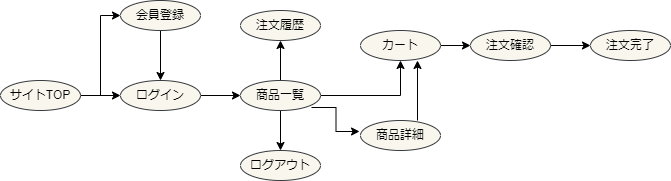
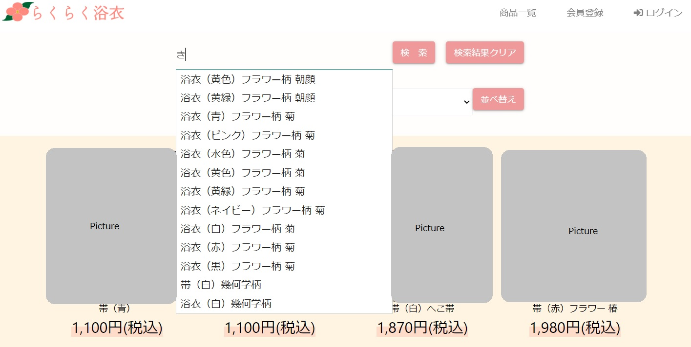
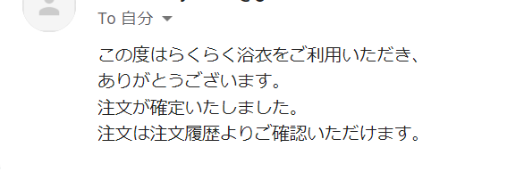
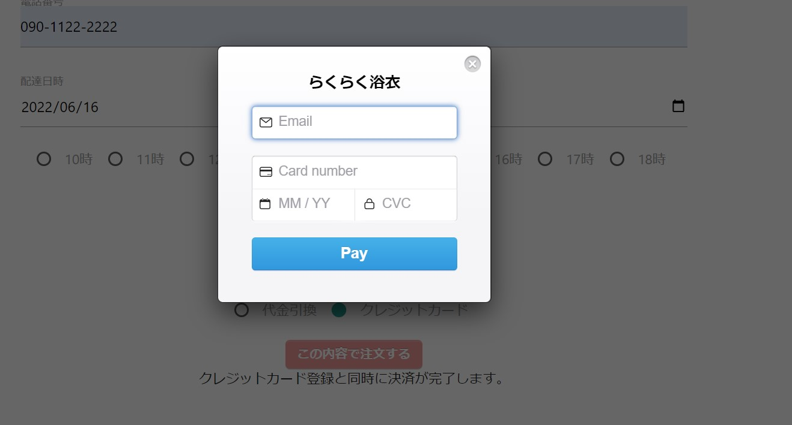

# 浴衣販売ECサイト　:sunflower: :kimono:
浴衣販売のECサイトです。
画像など一部を除いています。

## 目次
- 使用ツール
- セットアップ
- 実装機能
## 使用ツール
フロント
- HTML
- CSS
- materialize(1.1.0)
- jQuery(1.11.3)

サーバー
- Java(openjdk 18.0.1.1)
- Springboot(2.7.0)
- Thymeleaf
- JavaScript

データベース
- PostgreSQL

## セットアップ
### Javaインストール
使用したのはopenjdk(18.0.1.1)です。  
インストールは[こちら](https://jdk.java.net/18/)から。

### Spring Tool Suiteインストール
使用したのはSpring Tools 4 for Eclipseです。  
最新バージョンは4.15.1です。  
インストールは[こちら](https://spring.io/tools)から。

### データベース
使用したのはPostgeSQLです。  
「student」という名前のデータベースを作成し、[こちら](https://docs.google.com/document/d/1qPmDEEQ5emsmlowiZsx1e-v_p-lIZqphPEnjqm9M5EI/edit)のSQLを実行してください。  

ER図は下記の通りです。  

  
ER図

  準備中

## 実装機能

  
サイトマップ

  
  

  
ユーザー登録・入力値チェック・ログイン・ログアウト機能

  
商品検索時のオートコンプリート機能

  
  商品一覧ページ上部に商品検索フォームを設置しています。  
  フォームに文字を入力すると、それが含まれる商品名が候補として表示されます。  
  漢字・平仮名ともに対応しています。  
  

  
ショッピングカート機能

  
  「カートに入れる」ボタンを押すとカートに商品が入り、「削除」ボタンを押すとカートから商品が削除されるように実装しました。

  
注文完了メール送信機能

  
  注文確認と同時に注文完了メールが自動で送信されるよう設定しました。
  
  
  

  
外部APIを用いたクレジットカード決済（テスト環境）

  
  [stripe](https://stripe.com/jp)  のテスト環境を用いて、クレジットカードでの決済を導入しました。
  
  

  

